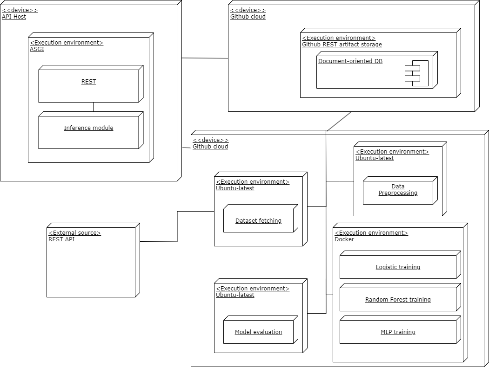

# Проектная работа по дисциплине "Архитектура систем ИИ"

## Автор: Филиппенко Илья (P4141)

---
## Тема работы: "Рекомендация фильмов"

## Цель работы: "Создание пайплайна обучения моделей для рекомендации фильмов для пользователя по его истории просмотров"

Задачи:

1. Анализ существующих решений;
2. Сбор данных;
3. Обучение выбранных моделей;
4. Оценка моделей исходя из показателей полученных метрик: Precision, Recall, Accuracy, F1-score на исходном наборе данных; анализ confusion matrix; будет применена кросс-валидация;
5. Выбор оптимальной модели;
6. Развёртывание оптимальной модели;

В ходе работы требуется пайплайна обучения моделей для рекомендации фильмов для пользователя на основании истории просмотров.

Для примера взят [датасет по умолчанию](https://gist.githubusercontent.com/zeionara/de67f6c5ced7a7b04eac8d6556265e8e/raw/8aac306c985bd9e9e565fd97f4c6ea51c45a7d2c/ratings.csv), экспортированный с IMDB.

Репозиторий проекта: [movie-recomender](https://github.com/va1korion/movie-recomender)

## Задача 

Регрессия оценки по 10-бальной шкале отдельно взятого пользователя для фильма по поверхностным данным

## Описание датасета

- Объем: 520 строк
- Практически не содержит пропусков. 
- При принадлежности фильма к нескольким жанрам все записываются в строку.
- Совмещает строковые и численные форматы данных 

## Целесообразность использования выбранного датасета

- Датасет содержит инофрмацию о фильмах, которые пользователь оценил на сайте IMDb.com
- Датасет также содержит поверхностную информацию о фильме, которую можно узнать до просмотра
- Наличие IMDb id позволит добывать дополнительную информацию запросами к API TMDb
- Пользовательские оценки слабо коррелируют со средним рейтингом IMDb, как и прочие
- Распределение оценок пользователя, говорит о том, что бинарная классификация не подойдет 
- Ни один из параметров не дает однозначной рекомендации (на изображении сравнение feature importance признаков)  

---

## Deployment diagram

Диаграмма развертывания.

За страшным словосочетанием Document-oriented DB прячутся непосредственно
- Хранилище артефактов (моделей и метрик)
- Хранилище пользовательских датасетов

## Process diagram

Диаграмма процессов

